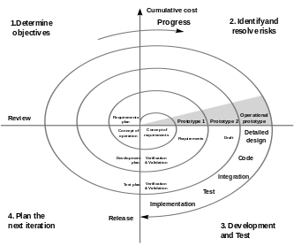
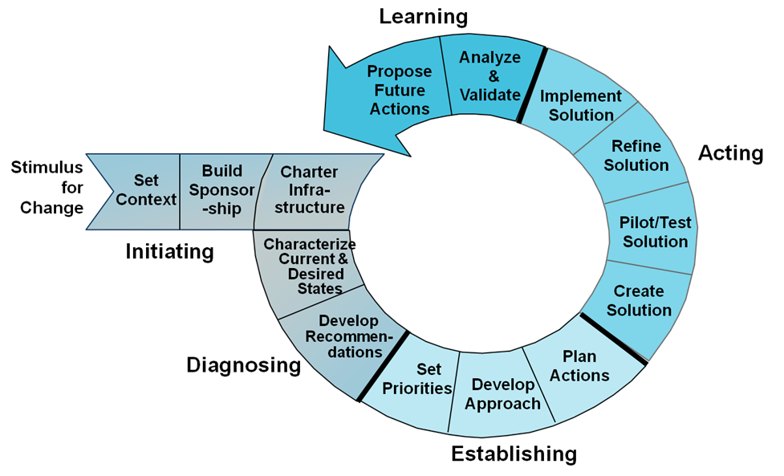

# CISSP201805
A NetAcademia 2018 májusi CISSP tanfolyam kiegészítő kódtára

## Szoftverfejlesztés és adatbázisok

## Computing Systems
A biztonsági kérdéseket fontos áttekinteni a számítógépes architektúra területén.

### Hardware
#### Processor
CPU Central Processing Unit

- Korlátozott számítási és logikai műveletre képes
- Az összetett feladatok elvégzéséért az OS és a magasszintű program fordító/futtató környezet a felelős.
- Moore törvénye (Gordon Moore)
  - 1965: a köetkező 10 évben a tranzisztorok **sűrűsége** meg fog duplázódni az integrált áramkörökön.
  - 1975: újraértékelt, és a törvényt a következő 10 évre is kiterjeszti
  - David House (Intel): a mennyiség mellett a sebesség növekedést is figyelembe véve azt mondta, hogy a processzorok teljesítménye 18 havonta meg fog duplázódni.

- konkrét példa: a Lotus-123 és az Excel párharca.

- A processzorok teljesítménye előre kiszámíthatóan korlátos marad, ezzel szemben a felhasználók igénye gyakorlatilag határtalan. Ezért erős az igény a párhuzamos feldolgozás kiszolgálására. Hogy lehetne két dolgot egy időben elvégezni?

#### Végrehajtási típusok (Execution Types)

##### több feladat egyidejű elvégzése (multitasking)
A legtöbb rendszer erre nem képes, az operációs rendszer ad egy olyan szolgáltatást, aminek a segítségével több feladatot apró részekre bontva, majd ezeket az apró részeket sűrűn felváltva a processzor látszólag minden feladatot egyszerre hajt végre. Valójában a CDP idejét bontjuk apró szeletekre, és egy egy szeletet különböző feladatnak engedünk.

##### több folyamat egyidejű elvégzése (multiprocessing)
Folyamatok párhuzamos végrehajtásra képes hardware.

- SMP: Symmetric Multiprocessing
  egy számítógép több processzort tartalmaz, de az OS, a memóriahasználat és az adathozzáférés közös. Ez általában 2-16 processzort jelent számítógépenként.

- MPP: Massive Parallel Processing
  több száz vagy akár több ezer processzor, processzoronként saját OS, memória és adathozzáférés. Például: particionált adatok.

Következő generációs (SMP) multiprocessing: többmagos processzorok segítségével egy CPU-n belül több műveletvégrehajtás történhet egyidejűleg. 

##### párhuzamos programozás (multiprogramming)
Az alkalmazást írjuk úgy, hogy képes legyen több feladat egyidejű számolására. Ez inkább a régi mainframe-ek sajátja.

##### töbszálú feladat végrehajtás (multithreading)
A modern operációs rendszerek (Windows/Linux) képes egy folyamaton belül (process) párhozamos "szálakat" (thread) szolgáltatni, aminek az az értelme, hogy thread-ek közötti feladatváltás sokkal kevesebb processzorutasításból oldható meg (50 utasítás) mint az egyes processzek közötti váltás (1000 utasítás).


```
+----------------------+                        +----------------------+
|    Alkalmazás        |                        |    Alkalmazás        |
|                      |                        |                      |
| +----+  +----+ +-----+                        | +----+  +----+ +-----+
| |Szál|  |Szál| |Szál |                        | |Szál|  |Szál| |Szál |
| |    |  |    | |     |                        | |    |  |    | |     |
| +--+-+  +--+-+ +---+-+                        | +--+-+  +--+-+ +---+-+
|    |       |       | |                        |    |       |       | |
|    |       |       | |                        |    |       |       | |
|    |       |       | |                        |    |       |       | |
|    |       |       | |                        |    |       |       | |
|    |       |       | |     1000 utasítás      |    |       |       | |
|    |       |       | | +------------------->  |    |       |       | |
|    |  50   |   50  | |                        |    | 50    |  50   | |
|    v       v       v |                        |    v       v       v |
|                      |                        |                      |
|                      |                        |                      |
|                      |                        |                      |
+----------------------+                        +----------------------+
```

A process saját memóriával rendelkezik, a thread-eknek nincs saját memóriája, de minden thread-nek saját hívási verme van (call stack).

```


        Dokumentumkezelés                          Dokumentum betöltése                    Állománykezelés
     +----------------------+                 +----------------------------+            +----------------------+
     |                      |           +>--> |                            |      +>--> |                      |
     |  Utasítások          |           |     |                            |      |     |  Utasítások          |
     |      +               |           |     |   Utasítások               |      |     |      +               |
     |      |               |           |     |       +                    |      |     |      |               |
     |      +---------------------------+     |       |                    |      |     |      |               |
     |      | ^-------------------------+     |       | +------------------------->     |      |               |
     |      |               |           ^     |       | ^-------------------------+     |      |               |
     |      |               |           |     |       |                    |      |     |      |               |
     |      |               |           |     |       |                    |      |     |      |               |
     |      |               |           |     |       |                    |      |     |      |               |
     |      |               |           |     |       |                    |      |     |      |               |
     |      |               |           |     |       |                    |      |     |      |               |
     |      v               |           |     |       |                    |      |     |      v               |
     |                      |           |     |       v                    |      |     |                      |
     +----------------------+           |     |                            |      <---- +----------------------+
                                        <--+  +----------------------------+
             ^                                                                                    ^
             |                                        ^                                           |
             |                                        |                                           |
             |                                        |                                           |
             |                                        |                                           |
             |                                        |                                           |
             |                                        |                                           |
             <------------------------------------------------------------------------------------+
                                                                                                  +
                                                                                                  Call Stack
```

###### Multithread programozás demo

```csharp
/// <summary>
/// a .NET (dotnet) a Microsoft programozási paradigmája, válasz a Java-ra
/// közös tulajdonságuk, hogy nem a processzor által azonnal futtatható (un. gépi kódot)
/// készít a fordító, hanem egy saját közös nyelre fordít le mindent (Intermediate Language-IL)
/// a magas szintű nyelvekről (VB.NET/C#/PHP).
/// 
/// Ezt az IL nyelvű kódot, az adott operációs rendszer .NET környezete futtatja:
/// menet közben lefordítja gépi kódra, és azt már az OS tudja a processzornak adni.
/// 
/// Ezzel biztosítja (egyebek mellett) a multiplatformosságot.
/// 
/// (a Java-nál byte kód és virtual machine a megfelelő fogalmak nevei.)
/// </summary>
class Program
{
    static void Main(string[] args)
    {
        Console.WriteLine("Alkalmazás elindult!");

        //a dotnet beépített thread kezelése
        //ezen keresztül kérhetünk egy futtatási szálat.
        ThreadPool.QueueUserWorkItem(Adatfeldolgozas);
        ThreadPool.QueueUserWorkItem(Chatkiszolgalas);

        Console.ReadLine();
        Console.WriteLine("Alkalmazás véget ért!");
    }

    /// <summary>
    /// Saját szálon futó folyamat, nem kell törődnöm azzal, hogy 
    /// a program többi része hol tart.
    /// </summary>
    /// <param name="state"></param>
    private static void Chatkiszolgalas(object state)
    {
        System.Console.WriteLine("- - -> Chatkiszolgálás elindult");
        for (int i = 0; i < 1000; i++)
        {
            Thread.Sleep(200);
            System.Console.WriteLine("- - -> Chatkiszolgálás folyamatban");
        }
        System.Console.WriteLine("- - -> Chatkiszolgálás véget ért");
    }

    private static void Adatfeldolgozas(object state)
    {
        System.Console.WriteLine("- -> Adatfeldolgozás elindult");
        for (int i = 0; i < 1000; i++)
        {
            Thread.Sleep(500);
            System.Console.WriteLine("- -> Adatfeldolgozás folyamatban");
        }
        System.Console.WriteLine("- -> Adatfeldolgozás véget ért");
    }
}
```
###### Multithread programozás demo 2.

```csharp
static void Main(string[] args)
{
    Console.WriteLine("Alkalmazás elindult!");

    //a dotnet beépített thread kezelése
    //ezen keresztül kérhetünk egy futtatási szálat.
    ThreadPool.QueueUserWorkItem(Adatfeldolgozas);
    ThreadPool.QueueUserWorkItem(Adatfeldolgozas);
    ThreadPool.QueueUserWorkItem(Adatfeldolgozas);
    ThreadPool.QueueUserWorkItem(Adatfeldolgozas);
    ThreadPool.QueueUserWorkItem(Adatfeldolgozas);
    ThreadPool.QueueUserWorkItem(Adatfeldolgozas);
    ThreadPool.QueueUserWorkItem(Adatfeldolgozas);
    ThreadPool.QueueUserWorkItem(Adatfeldolgozas);
    ThreadPool.QueueUserWorkItem(Adatfeldolgozas);
    ThreadPool.QueueUserWorkItem(Adatfeldolgozas);

    Console.ReadLine();
    Console.WriteLine("Alkalmazás véget ért!");
}

private static void Adatfeldolgozas(object state)
{
    System.Console.WriteLine("- -> Adatfeldolgozás elindult");
    Thread.Sleep(5000);
    System.Console.WriteLine("- -> Adatfeldolgozás véget ért");
}
```
A program futtatásakor látszik, hogy az első négy szál azonnal elindul (mivel a gép ahol futtatom négymagos processzor köré épült), majd szépen lassan a többi szál is elindul, de annak idő kell.

Megjegyzések:

- kód párhozamos futtatásához nem kell semmilyen különleges programozási módszertan, a futtatókörnyezet (.NEt + OS) szolgáltatja.

- a párhuzamosság miatt csak akkor kell párhuzamos helyzeteket megoldani, ha a szálaknak együtt kell működnie.s

#### Folyamat típusok (Processing Types)
A magas biztonságú rendszerek különböző biztonsági szinteket állapítanak meg, ennek segítségével szabályozzák a hozzáférést. Például:

- besorolás nélküli
- érzékeny
- bizalmas
- titkos
- szigorúan titkos

A feladat az az, hogy az egyes biztonsági szintet megkövetelő lehetőségekhez csak az adott besorolású személyek személyek férjenek hozzá. 

##### Single state
Ha nem akarjuk technikailag beépíteni a hozzáférési szabályozást minden rendszerbe, akkor megtehetjük, hogy **single state** típusként üzemeltetünk. Egyszerre csak egy féle hozzáférést enged a rendszer, vagyis hétfőn csak szigorúan titkos, kedden csak titkos, szerdán csak bizalmas, csütörtökön csak érzékeny és pénteken besorolás nélküli használatot engedünk.

##### Multi State
Egyszerre többféle besorolásnak megfelelő hozzáférést képes kezelni a rendszer. Ez azért nehéz ügy, mert a szabályoknak megfelelően a különböző szintek adatai semmilyen formában nem keveredhetnek egymással. 
Ez a mechanizmus nagyon költséges, és az ilyen rendszerek nagyon drágák. Az MPP rendszerek közül egyes drága rendszerekben van olyan indok, ami értelmessé teszi ezt a kialakítást.

#### Protection rings
1963, Multics operációs rendszer készítésekor a MIT, a Bell Laboratórium és a General Electric fejlesztése.
A Unix operációs rendszer fejlesztéséhez is ez az alapelv, és modern OS-ek alapelve.

```
+-----------------------------------------------+
|                                               |
|      User-level programs and applications     |
|      (Ring 3)                                 |
|                                               |
|    +-------------------------------------+    |
|    |      Drivers, protocols             |    |
|    |      (Rind 2)                       |    |
|    |                                     |    |
|    |   +---------------------------+     |    |
|    |   |  Other OS komonents       |     |    |
|    |   |  (Ring 1)                 |     |    |
|    |   |                           |     |    |
|    |   | +--------------------+    |     |    |
|    |   | |                    |    |     |    |
|    |   | |  OS kernel/memory  |    |     |    |
|    |   | |  (Ring 0)          |    |     |    |
|    |   | |                    |    |     |    |
|    |   | +--------------------+    |     |    |
|    |   |                           |     |    |
|    |   |                           |     |    |
|    |   +---------------------------+     |    |
|    |                                     |    |
|    +-------------------------------------+    |
|                                               |
+-----------------------------------------------+
```
Addig, amíg alacsonyabb szinten van végrehajtandó folyamat, addig a magasabb szinten lévő folyamat nem kap végrehajtási lehetőséget.

- Ring 0-2: Privileged 
- Ring 3: User

#### Folyamat állapotok (Process states)

```
                                                                        +----------+
                    Process needs another time slice                    |          |
+-------------+   <------------------<------------------+               |  Stopped |
|             |   |                                     |               |          |
| New process |   |                                     |               +-----+----+
|             |   |                                     |                     ^
+---+---------+   |                                     |        When process |
    |             v                                     +        finished or  |
    |                                                            terminated   |
    |         +-------+   If CPU is available      +---------+                |
    |         |       |                            |         |                |
    +-------->+ Ready +--------------------------->+ Running +---------------->
              |       |                            |         |
              +-------+                  +-------> +----+----+
                                         |              |
                             Unblocked   |              |
                                         |              |  block for I/O,
                                         |              |  resources
                                         |              |
                                         +              |
                                                        |
                                    +---------+         |
                                    |         |         |
                                    | Waiting |  <------+
                                    |         |
                                    +---------+

```

- **Ready:** (a folyamat) végrehajtásra kész. Ha lesz szabad processzor, akkor ezt a folyamatot végre is hajthatja. A hozzárendelt erőforrások ki vannak osztva neki.
- **Waiting:** Külső erőforrásra vár. A futása addig blokkolódik, amíg az erőforrás hozzárendelése megtörténik.
- **Running:** A folyamatot a CPU végrehajtja. Addig tart, amíg a) folyamot véget ér, vagy b) le nem jár az időszelete, vagy c) a folyamat erőforrásigény miatt blokkolt állapotba kerül.
- **Stopped:** A folyamat véget ért. Vagy azért, mert végzett, vagy mert meg kellett szakítani (hiba, esetleg nem elérhető erőforrás miatt). Ilyenkor a folyamatunkhoz hozzárendelt erőforrások elvonhatók és újraoszthatók.
- **Supervisory:** Amikor a folyamat végrehajtásához magasabb jogok kellenek (egy körrel beljebb kell hozzá kerülni).

#### Memory
- ROM: Read Only Memory
- PROM: Programmably Read Only Memory
- EPROM: Erasable Programmable Read Only Memory
- EEPROM: Electronically Erasable Programmable Memory
- Flash: blokkonként törölhető EEPROM
- RAM: Random Access Memory: áram kell neki, hogy megtartsa a beleírt adatot
  - dinamic: kapacitásokból áll, ami idővel elveszíti a töltését, így a processzornak frissítenie kell időről időre a tartalmat.
  - static: flip-flop áramkörökből áll, amíg áram alatt van nem felejt, a processzornak nem kell frissítést végeznie. Drágább és gyorsabb eszköz. Cache memória: az L1 a processzoron van, az L" pedig static RAM.

```
   Egy lap 256 helyet tartalmaz
+--------------------------------+
|                                |
|     RAM                        |
|                                |
|                                |
|  +------------------------+    |
|  | 0|255 bináris szám     |    |
|  +------------------------+    |
|  | 0|255 bináris szám     |    |
|  +------------------------+    |
|  | 0|255 bináris szám     |    |
|  +------------------------+    |
|  | 0|255 bináris szám     |    |
|  +------------------------+    |
|  | 0|255 bináris szám     |    |
|  +------------------------+    |
|  | 0|255 bináris szám     |    |
|  +------------------------+    |
|  | 0|255 bináris szám     |    |
|  +------------------------+    |
|  | 0|255 bináris szám     |    |
|  +------------------------+    |
|                                |
+--------------------------------+
```

Ha például 8 bites rendszerünk van, akkor egy memóriahelyre (imt önállóan lehet címezni, tehát bele írni és belőle olvasni) 256 féle érték kerülhet. Így 256 féle címet tartalmazhat. Ha több, mint 256 helyünk van, akkor a memóriát 256 egységes **lapokra** osztjuk, és a címek két részből állnak: a lap címéből, és a lapon belül a memóriahely címéből.

#### Registers
Spceiális memóriák, a processzor végrehajtási egységével (ALU: Arithmetic-logical unit) szinkron sebességgel dolgoznak. Rajtuk keresztül kapja a processzor az adatokat, a segítségükkel végzi a műveletet.

- **Register addressing:** amikor a processzor a regisztert célozza (címzi). Például: **register 1**
- **Inmediate addressing:** közvetlen műveletvégzés, register segítségével Például: **add 2 to register 1**
- **Direct addressing:** a regiszterben a memóriahely címe van, amivel dolgozni kell. **Ezen a memóriahelyen van az adat** a számoláshoz. Ez a cím a végrehajtandó utasítással egy lapon van. (különben két rész kéne a címhez: lapcím (base) és azon belül a memória címe (offset))
- **Indirect addressing:** a register által megcímzett memóriahely nem adat van, hanem egy újabb cím, ami az adatot tartalmazza a művelethez. (A cím egy lapon van a paranccsal.)
- **Base+Offset addressing:** amikor az adat nincs azonos lapn a művelettel, akkor agy a lapcím + lapon belüli memóriacím párossal jutunk el az adatig.

#### Primary, Secondary storage
- **Primary:** olyan memória, amit regiszter műveletekkel elérünk. Ez a "valódi" memória. *Gyors és drága*
- **Secondary:** először be kell tölteni a primary storage -be használathoz. *Lassú és olcsó*.

- **Virtual memory**, **virtual storage**: az operációs rendszer kezeli, segítségével elsődlegesnek látszik.

#### I/O devices
- Monitor
- Printer
- Keyboard/Mouse
- Modems
  - Memory-mapped I/O
  - IRQ
  - DMA
- Firmware
  - BIOS
  - Device firmware

## Adatbázisok (Databases)
Az adatok kiegészítve a hozzáférés módjával. Vagyis az adatok mellett az alkalmazás is, ami a felhasználó számára lehetővé teszi, hogy az adatokat lekérdezze, létrehozza, módosítsa, törölje. 

DBMS: Database Managamant Systems
- a program, ami a felhasználó számára lehetővé teszi, hogy az adatokat lekérdezze, létrehozza, módosítsa, törölje az adatokat.
- adatok mentése és visszatöltése (Backup and Recovery)
- lekérdező nyelv biztosítása (SQL)
    - SQL/DQL: Data Query Language
    - SQL/DML: Data Manipulation Language
- az adatbázis struktúrájának a kezelő nyelve (SQL/DDL: Data Definition Language)
- az adatok hozzáférésének a szabályozása (SQL/DCL: Data Control language)

### Hierarchikus adatbázisok (Hierarchical Databases)
A hierarchikus adatbázis fa struktúrájú adatok nyilvántartására készült.

Példa:
```
                <-------------------+  Vezérigazgató +------------------->
                |                            +                           |
                |                            |                           |
                v                            v                           v
          Értékesítés                 <-+ Számlázás +->+             Logisztika
               +                      |                |                 +
               |                      |                |                 |
               v                      v                v                 v
Értékesítési vezető                 Számlázó 1   Számlázó 2          Raktáros

```
Másik példa a DNS: Domain Name System.

felső szintű domainek: .hu, .com, stb.

www.netacademia.hu 

Minden csomópontnak egy szülője és tetszőleges számú gyermek csomópontja lehet, vagyis, egy-a-többhöz adatokat kezel.

### Elosztott adatbázisok (Distributed Databases)
A felhasználó számára egy rendszernek látszik, az adatok egymástól elválasztva több fizikai helyszínen vannak. Az egyes objektumoknak több szülője és több gyermeke is lehet, vagyis több-a-többhöz adatok nyilvántartására szolgál. A faceboook ismerősi hálózata például ilyen adatbázis.

### Objektumorientált/Objektumrelációs adatbázisok (Object oriented Databases)
Az objektum orientált programozási alapelvek összekombinálása az adatok nyilvántartásával, ennek köszönhetően az adatok egységbezárása és leszármaztatása az adatbázison belül megvalósítható. A kód újrafelhasználhatóságát és a hibakeresést is jól támogatja. Sokkal alkalmasabb multimédiás, CAD, grafikai és szakértői rendszerek támogatásához.

### Reláció adatbázisok (Relational Databases)
IBM, 1970, Codd. SEQUEL: Structured English Query Language. 

A relációs adatbázis un. relációkat (relation) (adattáblákat) kezel.

Például egy partnereket és a hozzájuk tartozó pénzmozgásokat nyilvántartó táblázat

---
|Név|Cím|Partner név|Partner cím|Összeg|
|-|-|-|-|-|
|Gipsz Jakab|1000 Budapest|Nagy Zoltán|2000 Szentendre|+5000|
|Gipsz Jakab|1000 Budapest|Kiss Tamás |1200 Budapest|+7000|
|Nagy Zoltán|2000 Szentendre|Kiss Tamás |1200 Budapest|-3000|
|Kiss Tamás|1000 Budapest|Gipsz Jakab |1200 Budapest|+4000|

#### SQL Szolgáltatásai
- adatok táblázatban
    - vizszintesen: sorok, rekordok (row=record=tuple)
    - függőlegesen: oszlopok, mezők (column=field=attribute)
- vizszintes irányban a táblázat struktúrája ritkán változik, függőleges irányban pedig állandóan. Az adatbáziskezelő munkájának nagy része a sorok létrehozásával, módosításával, lekérdezésével és törlésével telik.

ebből az adathalmazból a relációs adatbázis világban a következő struktúrát gyártjuk:

Partner tábla
---
|Kulcs|Név|Cím|
|-|-|-|
|1|Gipsz Jakab|1000 Budapest|
|2|Nagy Zoltán|2000 Szentendre|
|3|Kiss Tamás|1200 Budapest|

##### Kulcsok (Keys)
- **Candidate Key** (lehetséges kulcsmező): a rendelkezésünkre álló adatok alapján képes egy sort azonosítani.
- **Primary Key (PK)** (elsődleges kulcs): ami egyértelműen azonosítja a sort.
  - lehet Identity (nővekvő egész szám), ezt az adatbázis adja
  - lehet (GUID: Globally Uniq IDentifier): egy speciálisan számolt érték, az a lényege, hogy minden GUILD a világon egyedüliként jön létre. Ezt számolhatja a kliens és az adatbázis is.
  - az azonosításhoz használhatunk több mező kombinációját is (Composite Key)
- **Foreign Key (FK)** (távoli kulcs): ami egy másik táblában egy PK mezőre "mutat". 

Összegek tábla
---
|Partner 1| Partner 2| Összeg |
|-|-|-|
|1|2|+5000|
|1|3|+7000|
|2|3|-3000|
|3|1|+4000|

##### Adatbázisok normalizálása
Azt jelenti, hogy az adatok redundanciájának csökkententése illetve az integritásának növelése céljából alakítjuk az adattáblák struktúráját. A folyamat szabványosított, normálformák írják le, hogy milyen feltételeknek kell az adatbázisban érvényesülni, hogy azt mondhassuk, hogy 1NF->2NF->3NF->4NF.

[Ebben a cikkben](https://www.lifewire.com/database-normalization-basics-1019735) röviden az egyes normálformákról lehet olvasni.

##### Gyakorlati példa

Ha helyi SQL adatbázison dologzunk, akkor létre kell hozni az adatbázist és utána ki is kell választani, így:

```sql
--adatbázis létrehozása
create database CISSP2018
go

--a létrehozott adatbázist kiválasztjuk
use CISSP2018
go
```

ez után, vagy pedig ha az [SQLFiddle](http://sqlfiddle.com) oldalon próbáljuk ki a kódot, akkor nem kell létrehozás, csak ami most jön:

```sql
--két tábla létrehozása (DDL: Data Definition Language)
create table Partnerek (
	Kulcs int not null primary key clustered,
	Nev nvarchar(50),
	Cim nvarchar(50)
)
go

create table Osszegek (
	Kulcs int not null primary key clustered,
	Partner1 int,
	Partner2 int,
	Osszeg int,
	constraint fk_osszegek_partnerek1 foreign key (Partner1) references Partnerek (Kulcs),
	constraint fk_osszegek_partnerek2 foreign key (Partner2) references Partnerek (Kulcs)
)
go
```

Figyelem, ezt a két scriptet egyszerre kell az SQLFiddle-ben használni.

```sql
--ezt követően fel kell tölteni adatokkal (DML: Data manipulation Language)
insert Partnerek values (1, 'Gipsz Jakab', '1000 Budapest')
go

insert Partnerek values (2, 'Nagy Zoltán', '2000 Szentendre')
go

insert Partnerek values (3, 'Kiss Tamás', '1200 Budapest')
go

insert Osszegek values (1,1,2,5000)
go

insert Osszegek values (2,1,3,7000)
go

insert Osszegek values (3,2,3,-3000)
go

insert Osszegek values (4,3,1,4000)
go
```

Példa az eredeti adatcsomag lekérdezhetőségére:

```sql
--lekérdezzük az adatokat DQL: Data Query language
select
  Partnerek1.Nev,
  Partnerek1.Cim,
  Partnerek2.Nev,
  Partnerek2.Cim,
  Osszegek.Osszeg
from
  Osszegek
  inner join Partnerek Partnerek1 on Partnerek1.Kulcs = Partner1
  inner join Partnerek Partnerek2 on Partnerek2.Kulcs = Partner2
  
```

```sql
--Kis Tamás elköltözik Kecskemétre (DML)
update 
  Partnerek
set
  Cim='6000 Kecskemét'
where
  Kulcs=3
```

##### Az SQL adatbázis védelmi képességei

**Ezek azt szolgálják, hogy ne kerülhessen az adatbázisba érvénytelen információ**

- Entity integrity: garantálja, hogy minden sornak van PK-ja
- Referential integrity: az adott táblában lévő FK mező információja létező PK-ra mutat. (Létrehozáskor, módosításkor és törléskor) Például:

  ```sql

    delete Partnerek where Kulcs = 1

    ---eredménye: 
    --The DELETE statement conflicted with the REFERENCE constraint "fk_osszegek_partnerek1". The conflict occurred in database "db_18_d2dc4", table "dbo.Osszegek", column 'Partner1'.

  ```

- Semantic integrity: biztosítja, hogy a strukturális és szemantikai szabályok ki legyenek kényszerítve
  - not null
  ```sql
  insert Partnerek values (null, 'Tüdő Pál', '1000 Budapest')

  --eredménye:
  --Cannot insert the value NULL into column 'Kulcs', table 'CISSP2018.dbo.Partnerek'; column does not allow nulls. INSERT fails.
  ```
  - check constraint
    például: Összeg>0 nem enged 0-t vagy negatív számot felvinni.

###### SQL nézetek

Példa (az eredeti schema után még ezt is bemásolni az SQLFiddle-be):

```sql

create view EredetiAdathalmaz
as
select
  Partnerek1.Nev Nev1,
  Partnerek1.Cim Cim1,
  Partnerek2.Nev Nev2,
  Partnerek2.Cim Cim2,
  Osszegek.Osszeg
from
  Osszegek
  inner join Partnerek Partnerek1 on Partnerek1.Kulcs = Partner1
  inner join Partnerek Partnerek2 on Partnerek2.Kulcs = Partner2

```
Egy olyan virtuális táblát generál (egy olyan felületet ad a felhasználó felé) ami elrejti a mögötte lévő mechanizmust és a nyers adatokat, és saját jogosultságokat lehet hozzá megadni.

Lehetővé teszi, hogy az így létrehozott virtuális tábla megsértse a normalizálási szabályokat.

###### Database Schema
Definiálja az adatbázis felépítését
- Táblák (Tables)
- Táblák közti kapcsolatok (Relationships), FK
- Business rules
- Domains

###### Adatbázis integritása: a tranzakciók (Database integrity operations: transactions)
Minden adatbázis műveletre jellemzőek ezek a szabályok
- **A**tomic: nem részekre bontható, az egyes műveletek vagy együtt végrehajtódnak, vagy egyik sem hajtódik végre.
- **C**onsistency: az adatbázis műveletei megtartják a konzisztenciát, vagyis az integritási szabályoknak megfelelő állapotból a művelet után csak az integritási szabályíoknak szintén megfelelő állapotba kerülhet.
- **I**solation: amit tranzakcióban végzünk, azt a többiek addig nem láthatják, amíg nem végeztünk.
- **D**urable: ha a tranzakció végetért, akkor az eredménye tartósan megmarad.

```sql
begin transaction 

insert Partnerek values (4, 'Tüdő Pál', '1200 Budapest')

select * from Partnerek

insert Osszegek values (5,1,4,1000)

select * from Osszegek

--rollback

commit transaction
```

###### Konkurencia (Concurrency)
Az adatok szerkesztésének a felügyelete (edit control) egy megelőző mechanizmus, arra törekszik, hogy az adatbázisban tárolt információk helyesek legyenek, integritás és rendelkezésreállás szempontjából. Maga a védelem egy zárolási (lock mechanism) funkciót használ, hogy a módosítás konzisztens legyen: egy felhasználó módosítását engedélyezi, a többi hozzáférést megtagadja.

A módosítást követően a feloldás visszaállítja a többi felhasználó hozzáférését.

Bizonyos esetekben, ha a rendszergazda integrálja a konkurrens hozzáférés szabályozást naplózással, a módosítások nyomon követésére is alkalmas.

Amikor pedig a rögzített adatokat vizsgálják, a konkurrencia nyomozói eszközzé (detective control) válik.

##### Részletes hozzáférési szabályozás (granular control)
Az adatbáziskezelők (DBMS) közös biztonsági eleme, hogy az egyes alkotóelemekhez való hozzáférés részletekbe menően szabályozható.

##### Semantic integrity
Ez biztosítja, hogy a felhasználók semmilyen adatbázisba beállított szabályt ne tudjanak áthágni.

##### Date and Time stamps
Ha minden változási tranzakcióra időbélyeget teszünk, akkor biztosíthatjuk egy elosztott rendszeren belül is az adatok integritását.

##### Content-dependent access control
Ez a fajta ellenőrzés az adott objektum statikus beállításain kívül figyelembe veszi a hozzáférés céljaként szereplő objektum tartalmát. Mivel minden hozzáférésnél le kell fusson az ellenőrzés, így ez megnöveli a kiszolgáláshoz szükséges teljesítményt.

##### Cell supression
Az egyes adatbázis mezők vagy pedig egyes adatoknál a környezethez képest nagyobb biztonsági szint igénylése.

##### Context-dependent acces control
Az egyes objektumokhoz való hozzáférés mellett vizsgál egy nagyobb képet is a hozzáférések elbírálásánál. Az egyes tranzakciók/műveletek még érvényesnek tűnhetnek, de _eggyütt_ a műveletek már jelezhetnek valamilyen hozzáférési támadást.

##### Adatbázis particionálás
Az adatokat nem egy, hanem tulajdonságaik alaján több adatbázisba szedjük szét, így a sokkal finomabb jogosultságokat lehet aztán később beállítani.

##### Polyinstantiation
A példánkban egy tengeralattjáró lesz főszereplő. A tengeralattjárók adatait egy titkos (secret) besorolású intézményben kezelik. Itt a munkatársak hozzáférnek a titkos adatokhoz. Ha ezt tengeralattjárót elvezénylik egy szigorúan titkos (top secret) küldetésre, akkor az, aki eddig hozzáfért az adataihoz, egyből tudhatja, hogy valami történt. Ez az információ is önmagában védendő.

Ha viszont felveszünk egy top secret rekordot az adatbázisba a tengeralattjáróhoz a valódi adataival, akkor az eddigi munkatárs nem vesz észre semmit, viszont a megfelelő beosztású munkatárs hozzáfér az adatokhoz.

##### Noise and Perturbation
A nem élő (secret) rekordba hamis és félrevezető adatokat rögzítve megtéveszthetjük a jogosulatlan kíváncsiskodóakat.

Ez nagy óvatosságot igényel, hogy a zaj ne tegye tönkre a rendes folyamatokat.

##### Általános támadási módok
###### Támadási módok
- Aggregation (Összegzés)
  Egy katonai adminisztrátor a főszereplőnk. Pl.: ő rögzíti be a személyzeti nyilvántartást. Tehát X őrmestert áthelyezik A-ból B-be. Ezzel hozzáférést kap a személyzeti táblához, hogy ilyet tudjon rögzíteni.
  Ha hozzáférne a tábla összegzéséhez is, akkor az A és a B támaszpontok személyzeti létszámokat is le tudná kérdezni erre a két támaszpontra, ami nyilvánvalóan minősített adat kell, hogy legyen.

- Inference (Következtetéses támadás)
  A pénzügyi adminisztrátor a főszereplőnk. A cégösszesen bérköltségét le tudja kérdezni a riportokhoz. Ezeket a riportokat visszamenőleg is el tudja végezni. 
  Ezen kívül tudja azt, hogy egy munkatárs mikor lépett ki, vagy be. 
  Ha egy kérdéses napon csak egy ember lépett be, lekérdezi a cégösszesent a belépés előtti és a belépés napján, és így hozzáfér a munkatárs fizetési információjához, pedig ehhez nincs jogosultsága.

###### Védekezés
- A jogosultságok folyamatos követése
- Az adatok szándékos elmosása (data blurring)
- Az adatbázis több részre vágása, külön jogosultságokkal (data partitioning)

##### ODBC: Open Database Connection

```
                                               +----------+     +-------------+
                                               |          |     |             |
                                               | MS SQL   | +-> | MS SQL      |
                                +------------> | Driver   |     |             |
                                +              |          |     |             |
                                               +----------+     +-------------+
+---------------+        +-----------+
|               |        |           |         +----------+     +-------------+
|  Alkalmazás   |        | ODBC      |         |          |     |             |
|               |        | Connection|         | Oracle   | +-> | Oracle      |
|               | +----> |           | +-----> | Driver   |     |             |
|               |        |           |         |          |     |             |
|               |        |           |         +----------+     +-------------+
|               |        |           |
|               |        |           |         +----------+     +-------------+
|               |        +-----+-----+         |          |     |             |
|               |              |               | IBM DB2  | +-> | IBM DB2     |
+---------------+              +------------>  | Drive    |     |             |
                                               |          |     |             |
                                               +----------+     +-------------+
```
Az alkalmazás nem az adatbázis felülettel beszélget, hanem az ODBC meghajtóval, ami közvetíti a kérést és a választ az alkalmazás és az adott adatbázis között.

##### Storing Data and Information
Az adatbázisokhoz az elsődleges út az adatbázis kezelő alkalmazáson keresztül vezet. Az adatok azonban valamilyen tárolóeszközre kerülnek, amik óvatlan beállítás esetén hátsó ajtót biztosítanak az adatbázishoz.

###### Illegitimate access to storage resources
Ha nincs jól beállítva a hozzáférési környezet, például, ha az adatbázis állomány (file) eléréséhez szükséges jogosultságok nincsenek rendesen beállítva, akkor a betolaködő egyszerű böngészéssel eléri.

- Be kell állítani a jogosultságokat az OS-ben
- Az OS védelem megkerülése ellen a titkosított filerendszer (encrypted filesystem) a megoldás
- Különös figyelemmel kell lenni megosztott elsődleges és másodlagos memória beállításaira

###### Covert channel attack
Az információ átvitelét lehetővé tevő struktúrát általában csatornának (channel) hívjuk.
A rejtett csatorna (covert channel) olyan kommunikációs csatorna, ami a legális csatornát használja nem szabványos módon, így rejtve marad a védelmi mechanizmusok előtt, és nem érvényesülnek rá a biztonsági szabályok.

Lehet olyan formája, hogy az adatok egy óvatlanul megosztott memóriaterületre tévednek.

Bonyolultabb formája, ha a támadó a rendszer beállításait átírva (például a szabad hely mennyiségét vagy csak egy fájl méretét átírva) az adatok nem kívánt módon megjelennek olyan helyen, ahol nem lenne szabad lenniük.

### Vizsgapélda

#### Kérdés

Referring to the database transaction shown here, what would happen if no accounts exists in the Account table with account number 1001?

```sql
BEGIN TRANSATION
UPDATE accounts
SET balance = balance + 250
WHERE account_number = 1001;

UPDATE accounts
SET balance = balance – 250
WHERE account_number = 2002;

END TRANSACTION
```

- [ ] The database would create a new account with this account number and give it a $250 balance.
- [ ] The database would ignore that command and still reduce the balance of the second account by $250.
- [ ] The database would roll back the transaction, ignoring the result of both commands.
- [ ] The database would generate an error message

#### Kis segítség

A schema létrehozásához
```sql
create table accounts (
	account_number int not null primary key,
	balance int
);

insert into accounts (account_number, balance) values (1001, 0);

insert into accounts (account_number, balance) values (2002, 0);
```

A próbához:
```sql
select * from accounts

begin transaction

update accounts set balance = balance + 250 where account_number=1001;
update accounts set balance = balance - 250 where account_number=2002;

commit transaction

select * from accounts
```
## Szoftverfejlesztés

### Mi a baj a szoftverfejlesztéssel?
Rendkívül összetett és rengeteg kihívással teli feladatot tartalmazó problémakör. Biztonsági szempontból garantálni kell, hogy a folyamat és a végeredménye szabályozott, és az eredmény érvényesíti a biztonsági szempontokat. Utólag biztonságot beépíteni nem lehet, ezért a biztonsági szempontokat végig érvényesíteni kell.

A szoftverek:
- hozzáférnek érzékeny adatokhoz
- hozzáférhetőek több felhasználó számára
- sok esetben saját készül
- sok esetben "idegenek" készítik
- túl erős eszközök: közvetlenül
  - irányíthatják a hardver eszközöket
  - hozzáférnek az állományokhoz
  - hozzáférnek az I/O eszközökhoz
  - hozzáférnek a rendszer segédprogramokhoz
  - hozzáférnek a feladatok futtatásához/leállításához
  - beállíthatnak dátumot és időt
  - hozzáférnek naplókhoz
  - hozzáférnek erőforrásokhoz
- ha nem mi irányítjuk, támadhatnak más eszközöket (DDoS)

### Programozási nyelvek
A szoftver készítésénél az a transzformáció, amíg a feladatból futtatható gépi kód lesz (egyszerű összeadással, logikai művelettel vagy adatok mozgatásával) amit a CPU támogat, egy rendkívül hosszú és meglehetősen bonyolult dolog. Az egyes programozási nyelvek célja ennek a transzformációnak a megkönnyítése.

- 1GL: Gépi kód (processzor számára közvetlenül végrehajtható számsorozat: [itt lehet](https://courses.cs.vt.edu/~cs1104/VirtualMachines/MLEmulator.html) ilyet nézni
- 2GL: Assembly az egyes utasításokat rövidítésekkel jelöli, használ változókat, és egyből gépi kódra fordítható. ([itt lehet assembly + gépi kódot nézni](https://schweigi.github.io/assembler-simulator/), [egy másik assembly példa](http://carlosrafaelgn.com.br/asm86/index.html?language=en))
- 3GL: Fordított nyelvek (Fortran, Algol)
- 4GL: Megpróbálja a természetes nyelvet utánozni + SQL-t használ adathozzáférésre
- 5GL: Grafikus felületen keresztüli kód létrehozás ([egy példa](https://developers.google.com/blockly/)), de ilyenek például az űrlapszerkesztő által generált kód+adatbázis típusú fejlesztőeszközök.

- Fordított nyelvek és/vagy környezetek (Compiled Language)
  A forráskódot a fordító egy vagy több lépésben az adott fizikai gép gépi kódjára fordítja. Ez egy gépi kódu állomány lesz, amit aztán többször futtathatunk.
- Értelmezett nyelvek és/vagy környezetek (Interpreted Language)
  Vagy script nyelvi programok (javascript, BASIC), amiket menet közben fordít a környezet és a fordító gépi kódra. Minden futáskor lépésenként újra fordul.
- Felügyelt nyelvek (Managed Language)
  - Fordított nyelvnek számítanak, 
  - de nem gépi kódra, hanem egy köztes nyelvre **fordítanak** (Java: byte code, C# MSIL: Microsoft Intermediate Language)
  - A köztes nyelvet pedig a futtatókörnyezet (Java: java virtual machine, C#: .NET keretrendszer) **értelmezi** lépésről lépésre
  - a futtatókörnyezet ezek mellett
    - keresztplatformos, vagyis minden architektúrán más és más, csak annyira képes, hogy futtassa a köztes nyelvű programot
  - képes az OS API (Application Programming interface) elrejtve egységes felületet adni a programnak
  - felügyeli a futó programot, jogosultság, veszélyes műveletek szemponjából
  - memóriamanagementet ad a program számára

### Objektumorientált programozás

demo program:

```csharp
class Program
{
    static void Main(string[] args)
    {
        var cegesBankszamla = new Bankszamla("Abroncs és Fiai Kft.");

        System.Console.WriteLine($"Egyenleg: {cegesBankszamla.Egyenleg}");
        cegesBankszamla.Jovairas(5000);

        System.Console.WriteLine($"Egyenleg: {cegesBankszamla.Egyenleg}");
        cegesBankszamla.Terheles(2000);

        System.Console.WriteLine($"Egyenleg: {cegesBankszamla.Egyenleg}");
        cegesBankszamla.Terheles(4000);

        //ezt nem lehet végrehajtani, az egyenleg kívülről csak olvasható, nem írható
        //cegesBankszamla.Egyenleg = 3000;

        System.Console.WriteLine($"Egyenleg: {cegesBankszamla.Egyenleg}");

    }
}

internal class Bankszamla
{
    private string name;
    private int egyenleg;
    public object Egyenleg 
    { 
        get 
        { 
            return egyenleg; 
        } 
    }

    public Bankszamla(string name)
    {
        this.name = name;
    }

    internal void Jovairas(int osszeg)
    {
        egyenleg = egyenleg + osszeg;
    }

    internal void Terheles(int osszeg)
    {
        egyenleg = egyenleg - osszeg;
    }
}

```

#### Objektum orientált alapelvek
- Encapsulation (Egységbezárás): Az osztályon kívül csak az látszik, amit megengedünk.
- Abstraction (Absztrakció): Csak azzal foglalkozunk, ami egy adott szinten fontos
- Inheritance (Leszármaztatás): Az ős tulajdonságait **átvehetjük és kiegészíthetjük**
- Polimorpism (Változatosság): többféle változat kialakítható, az ős tulajdonságait **átvehetjük és meg is változtathatjuk**

- Osztály (Class) és Objektum (object) fogalma
  - Az **osztály** egy tervrajz, ami a tervek mentén létrehozandó objektum tulajdonságait írja le.
  - Az **objektum** pedig egy példánya az osztálynak.
- Ez a megoldás biztonsági szempontból egy **fekete doboz**.
- Az **objektum** egy másik definíciója, ezek a jellemzők igazak rá:
  - Identity: Azonosítható (bármely két objektumról el tudom dönteni, hogy azonosak-e vagy sem)
  - Behaviour: Van viselkedése (pl.: Terheles() és Jovairas())
  - State: van állapota (pl.: Egyenleg és Nev), ez időben változhat
- Az objektumorientált programozás nagyon fontos előnye, hogy **felületeket definiál**. A felület elválasztja egymástól a használót és a megvalósítást.
  - TV távirányító
  - Hangerőszabályzó

#### Az objektumorientált programozás előnyei
- Modularity (Moduláris)
- Reusable (Újrafelhasználhatóság) ennek két fontos feltétele van
  - High cohesion (erős kohézió) azt jelenti, hogy az osztályhoz tartozó feladatok (felelősségi körök) mennyire   hasonlítanak egymásra.
  - Low coupling (gyenge csatolás): csatolás: két egymással kapcsolatban álló osztály esetén az egyik megváltozása mennyire valószínűsíti a másik változtatási szükségességét. Gyenge a csatolás, ha ez az szükséglet **kizárható**.


Példa a nem újrafelhasználható kódra

```
                    +-----------+
                    |           |
                    |  Űrlap 1  |
                    |           |
                    |           |
      +---------------->  +---+ |
      |             |     |---| | +-------->---------->------------------->
      |             +-----------+                                         ^
      |                                                             +-----+-------+
      |                                                             |             |
      |             +-----------+                                   |  Adatbázis  |
      +             |           |                                   |             |
                    |  Űrlap 2  |                                   |             |
Adatbázist          |           |                                   |             |
módosító            |           |                                   |             |
rész a kódban +--------> +----+ |                                   +-------------+
                    |    |----| | +---------->----------->---------------->
      +             +-----------+                                         |
      |                                                                   |
      |                                                                   |
      |             +-----------+                                         |
      |             |           |                                         ^
      |             |  Űrlap 3  |                                         |
      |             |           |                                         |
      |             |           |                                         |
      +----------------> +----+ |                                         |
                    |    |----| | +--------->----------------------------->
                    +-----------+
```

Példa újrafelhasználható kódra
```
+-----------+
|           |
|  Űrlap 1  | +----------------->
|           |                   |
|           |                   v
|           |
|           |          +-----------------+
+-----------+          |                 |
                       |  Repository     |      +-------------+
                       |                 |      |             |
+-----------+          |                 |      |  Adatbázis  |
|           |          | Adatbázist      |      |             |
|  Űrlap 2  |          | módosító        |      |             |
|           +--------> | rész a kódban   +----> |             |
|           |          |                 |      |             |
|           |          |                 |      +-------------+
|           |          |                 |
+-----------+          |                 |
                       |                 |
                       +-----------------+
+-----------+
|           |                   ^
|  Űrlap 3  |                   |
|           |                   |
|           | +----------------->
|           |
|           |
+-----------+
```

### Assurance (Biztosíték)
Annak érdekében, hogy egy új alkalmazásban a a biztosítási mechanizmusok a rendszer teljes életciklusán keresztül a biztonsági szempontoknak megfelelően működjenek, garanciákat érdemes beépíteni.

például: [Trusted Computer System Evaluation Criteria (TCSEC)](https://hu.wikipedia.org/wiki/Trusted_Computer_System_Evaluation_Criteria)

#### Rendszerhiba elkerülése
Teljesen mindegy mennyire jó a fejlesztő csapat, a rendszer előbb-utóbb hibázni fog. Erre a hibára előre kell felkészülni, és így biztosítani, hogy a rendszer megfelelően reagáljon.

##### Input Validation (Beviteli adatok ellenőrzése)
A rendszerbe kerülő adatokat a rendszernek ellenőriznie kell.

MVC példakód készítéséhez a keret program legyártása
```powershell
dotnet new mvc --auth Individual --use-local-db
```

- lehet ellenőrizni típus szerint (szám, szöveg, dátum, stb.)
- lehet ellenőrizni értéktartomány szerint (legfeljegg 50 karakter, 1 és 12 közötti szám, stb.)
- lehet ellenőrizni tartalmazott karakterekre, veszélyes karaktereket szűrni (pl.: idézőjel, kérdőjel, pontosvessző, kisebb/nagyobb jel stb.) (escaping input)
- lehet kérni, hogy a beírt szöveget veszélymentesítsük (encoding input)

pl: ebből:
```
http://netacademia.hu
```
ezt készítjük:

```
http%3A%2F%2Fnetacademia.hu
```

[ennek a segítségével: urlencoder.org](https://www.urlencoder.org/)

- a bevitel ellenőrzését mindig szerver oldalon (is) el kell végezni

Fontos: a [secure coding](https://en.wikipedia.org/wiki/Secure_coding) elveket a fejlesztőktől [meg kell követelni](https://www.owasp.org/index.php/OWASP_Secure_Coding_Practices_-_Quick_Reference_Guide)!

##### fail-safe (fail-secure) és fail-open állapotok
- fail-safe (fail-secure)
  incidens esetén a rendszer fail-safe állapotba akkor kerül, ha a hibát követően működését felfüggeszti, általa adatokhoz, erőforrásokhoz csak akkor lehet hozzáférni, ha egy megfelelő szakember a helyzetet áttekintette. Erre jó példa a Blue Screen of Death (BSoD) a Windows esetén. Erre akkor kerül sor, ha például valamelyik hardver meghajtó olyan helyre ír a memóriában, ami nem az övé (ring protection).
  Annak a garantálásához hogy a rendszerünk nem megy tovább megfelelő személy nélkül, az automatikus bejelentkezést nem szabad engedélyezni.

- fail-open
  feloldhatatlan biztonsági probléma esetén is tovább megy a rendszer. Ekkor a felhasználók biztonsági követelményeket. 
  
A legtöbb esetben a fail-secure megoldás a megfelelő válasz.

Korlátozott esetben, ha több rétegű biztonsági rendszer egyik belső eleméről van szó, amit még védenek további rétegek, nagyon nagy odafigyeléssel kialakítható biztonságos rendszer fail-open elemekből, de ez nem olyan megoldás, amit egy biztonsági szakember szeretne a magáénak tudni.

Még ha be is van ágyazva a biztonság, a könnyebb telepítés és felhasználhatóság érdekében ez gyakran le van tiltva. Így ez az informatikai rendszergazda feladata, hogy bekapcsolja őket.

A biztonság fenntartása nőveli a költségeket és csökkenti a felhasználóbarátságot, így ezért aztán ezeket a szempontokat együtt kell érvényesíteni.

### Szoftberfejlesztési módszertanok és életciklus modellek

- CMM Capability Maturity Model: Minden előállítást végző szervezet ugyanazokon a fázisokon megy keresztül. Az elkészült termék minősége az előállítási folyamat minőségén múlik.

- A módszertan használata növeli az elkészült rendszer minőségét. Viszont a nem megfelelően használt megfelelően használt módszertan nem garantál semmit.

#### System Development Life Cycle (SDLC)

A biztonsági szempontokat a rendszer fejlesztésének teljes életcikusa során érvényesíteni kell.

##### Conceptual Definition
Egyszerű definíció, amit minden érdekelt fél elfogad.
- tisztázza rendszer célját és az alapvető követelményeket.
- nem kell, hogynéhány bekezdésnél hosszabb legyen.

##### Functional requirement determination
- Lista a fejlesztendő rendszer képességeiről. 
- Ezt is fontos, hogy minden érdekelt fél elfogadja. 
- ez adja az alapot a jelesztéshez és
- a fejlesztés végén jó eszköz az eredménynek az ellenőrzéséhez

##### Control Specification Development
- tervezni kell, hogy a jogosult felhasználók elérjék a rendszert, és ne léphessék túl a jogosultságukat.
- a bizalmas adatokat megfelelő titkosítással kell ellátni.
- naplót kell vezetnie a rendszernek a számonkérhetőség és a nyomozhatóság érdekében.
- a rendszer rendelkezésreállását a rendszer fontosságához mérten biztosítani kell.

Ez a munka nem egyszeri alkalom, hanem a terv változása esetén újra el kell végezni.

##### Design Review
- a működési struktúra elemeinek a meghatározása
- az elemek közötti kommunikáció meghatározása
- kezdeti ütemtervek kidolgozása

Ha a terv kész, minden érintett félnek el kell fogadni.

##### Code review walkthrough
A fejlesztés során elkészülő részeredményeket több szemmel is érdemes átvizsgálni.

##### System Tests Review
- a forgatókönyveket előre kell rögzíteni
- a fejlesztők és felhasználók is ellenőrzik a rendszer működőképességét
  - általános feltételek mellett
  - szokatlan/ritka feltételek mellett

##### Maintenance and Change Management
- a működőképesség biztosítása változó környezetben
- fontos, hogy minden változás formális változás felügyeleti programban végezzük.

#### Waterfall (vízesés) módszertan
1970: Winston Royce ([wikipédia](https://en.wikipedia.org/wiki/Waterfall_model))

Fázisokra osztja a fejlesztés menetét
- amíg egy fázis el nem készül, addig nem lépünk tovább.
- ha egy fázisról elléptünk, akkor nem lehet visszalépni.

1. Rendszer követelmények
2. Szoftver követelmények
3. Előzetes tervek
4. Részletes tervek 
5. Fejlesztés és hibajavítás
6. Tesztelés
7. Üzemeltetés

Továbblépés előtt ellenőrzés:
- Verification: követelmények szerint
- Validation: a való világ szerint

A továbbfejlesztés 1 visszalépést engedélyezett a fázisokban.

De ez nem lett túl sikeres, mert addigra elterjedt

#### Spiral model
1988: Barry Boehm

A modell négy területre oszja a fejlesztést,

- Célok, keretek, és alternatívák meghatározása
- Alternatívák elemzése, kockázatok azonosítása és kezelése
- Fejlesztés és ellenőrzés
- Következő fejlesztési fázis tervezése

Ez egy iteratív módszertan, felkészül arra, hogy elsőre nem sikerül tökéletesen a végeredményt előállítani.



#### Agile (Agilis) szoftverfejlesztés

- **Egyének és együttműködések** a *folyamatok és eszközök* helyett
- **Működő szoftver** az *átfogó dokumentáció* helyett
- **Együttműködés az ügyféllel** a *szerződés érvényesítése* helyett
- **Reagálás a változásokra** a *terv követése* helyett

A jobb oldalon szereplő dolgok is fontosak, de balaldalon szereplők még ennél is értékesebbek.

##### Alapelvek

- Legfontosabbnak azt tartjuk, hogy az ügyfél elégedettségét a működő szoftver mielőbbi és folyamatos szállításával vívjuk ki.
- Elfogadjuk, hogy a követelmények változhatnak akár a fejlesztés vége felé is. Az agilis eljárások a változásból versenyelőnyt kovácsolnak az ügyfél számára.
- Szállíts működő szoftvert gyakran, azaz néhány hetenként vagy havonként, lehetőség szerint a gyakoribb szállítást választva.
- Az üzleti szakértők és a szoftverfejlesztők dolgozzanak együtt minden nap, a projekt teljes időtartamában.
- Építsd a projektet sikerorientált egyénekre. Biztosítsd számukra a szükséges környezetet és támogatást, és bízz meg bennük, hogy elvégzik a munkát.
- A leghatásosabb és leghatékonyabb módszer az információ átadásának a fejlesztési csapaton belül, a személyes beszélgetés.
- A működő szoftver az elsődleges mércéje az előrehaladásnak.
- Az agilis eljárások a fenntartható fejlesztést pártolják. Fontos, hogy a szponzorok, a fejlesztők és a felhasználók folytonosan képesek legyenek tartani egy állandó ütemet.
- A műszaki kiválóság és a jó terv folyamatos szem előtt tartása fokozza az agilitást.
- Elengedhetetlen az egyszerűség, azaz az elvégezetlen munkamennyiség maximalizálásának művészete.
- A legjobb architektúrák, követelmények és rendszertervek az önszerveződő csapatoktól származnak.
- A csapat rendszeresen mérlegeli, hogy miképpen lehet emelni a hatékonyságot, és ehhez hangolja és igazítja az működését.

#### SCMM: Software Capability Maturity Model

A szoftver előállítási képesség érettségi (fejlettségi) modellje.

Alapelv: Minden szoftver előállítást végző szervezet ugyanazokon a fázisokon megy keresztül. Az elkészült szoftver termék minősége az előállítási folyamat minőségén múlik.

##### Initial (Level 1)
Az eredmény előrejelezhetetlen, a siker egyéni erőfeszítés eredménye. Gyakorlatilag fekete doboz.

##### Repeatable (Level 2)
**Hasonló** projektek esetén az eredmény ismételhető. Van kód újrafelhasználás, az alapvető fejlesztési folyamat felismerhető. Fekete dobozok sorozata.

##### Defined (Level 3)
A folyamat áttekinthető: dokumentált és szabványosított. Szoftver előállításhoz minden projekt a szervezet szabványos projektjeit használja. Nincs fekete doboz.

##### Managed (Level 4)
Előrejelezhető: a folyamat és a termék mennyiségi mérőszámokkal ellenőrzött. A folyamat méréséhez és megítéléséhez részletes adatok állnak rendelkezésre.

##### Optimizing (Level 5)
Folyamatosan fejlődő. A folyamat részei cserélődnek, a rossz kikerül.

#### IDEAL Model
[Software Engeneering Institute](https://resources.sei.cmu.edu)



A model 5 fázisra osztja egy rendszer fejlesztését. Nevét a fázisok kezdőbetűiről kapta. 

##### Kezdeti, indítási fázis (Initiating)
- az összefüggések meghatározása
- a támogatás kiépítése
- az infrastruktúra biztosítása

##### Felmérés (Diagnosing)
- a jelenlegi és a kívánt állapot meghatározása
- a fejlesztési javaslatok megtétele

##### Kiépítés (Establishing)
A hogyan meghatározása: hogyan érje el a szervezet a célját. Itt az előző fázis ajánlásaiból **konkrét cselekvési terv készül**
- prioritások meghatározása
- fejlesztési megközelítés (módszertan) meghatározása
- a tevékenységek megtervezése
##### Cselekvés (Acting)
Ebben a fázisban be kell fejezni a beszélgetéseket és látogatásokat. A szervezet **megoldást fejleszt**.
- megoldás létrehozása
- tesztje, pilot bevezetése
- finomítása
- megvalósítása

##### Tanulás (Learning)
A szervezet elemzi az erőfeszítéseket, és megvizsgálja, elérte-e a kívánt célokat, és ha szükséges új intézkedések javaslata.
- Analízis
- validálás
- javaslat jövőbeni tevékenységekre.

[Olvasnivaló az IDEAL modelről](http://www.plays-in-business.com/ideal-initiating-diagnosing-establishing-acting-learning/).
[SEI prezentáció összefoglalása](https://resources.sei.cmu.edu/library/asset-view.cfm?assetid=20208)

### Változáskezelés biztonsági eszközként (Change and Configuration management)

#### Request Control
- a kérelmeket befogadja
- költség/haszon elemzés készül
- priorizálás

#### Change Control
A fejlesztők
- elemzik, 
- alternatívákat állítanak, 
- ezeket értékelik, 
- a megoldást fejlesztik,
- a megoldás telepítéséhez végül eszközt biztosítanak,
- a megoldást dokumentálják.

#### Release Control
- ellenőrzi, hogy véletlenül bennehagyott hibakezelési eszközök, debug kapcsolók, naplózások ne maradjanak a megoldásban.
- ellenőrzi, hogy a megoldás a felhasználók számára megfelelő, használható és érthető.

##### Konfiguráció azonosítása (configuration identification)
Minden olyan lépés, ami a rendszer állapotán változtat nyomonkövethető ezáltal, egyészen az elejétől a végéig.
##### Konfiguráció kezelés (configuration control)
Ez biztosítja, hogy a megoldás a megfelelő szoftververziókat használó rendszerre kerüljön. A megoldás és a környezet frissítései engedélyezett forrásból kell, hogy származzanak.
##### Konfigurációs állapot nyilvántartása (Configuration status accounting)
Egyértelműen azonosíthatóvá teszi, hogy a rendszerünkön mi van telepítve.
##### Konfigurációs felülvizsgálat (Configuration audit)
Rendszeresen ellenőrizni kell a rendszer állapotát, és biztosítani, hogy ne legyenek nem engedélyezett vagy nem dokumentált változások.

### Szoftver tesztelés
- ésszerűség ellenőrzés (ha testsúlyt számol az adott rész, akkor nem adhat vissza értelmetlen adatot: pl. 1000kg-ot)
  ehhez értelmetlen bemeneti adatokkal is tesztelni kell az adott alkalmazást.
- normál és értelmes adatok esetén is vizsgálni kell az adott szoftver működését.
- tesztidőszakban éles adatokkal tesztelni nem szabad. A teszteléshez tesztadatokat kell generálni a megadott szempontok szerint.
  [Egy példa tesztadat generálásra](https://sachabarbs.wordpress.com/2018/06/11/bogus-simple-fake-data-tool/)

#### Tesztelési módszerek

##### Fehér doboz tesztelés (White box testing)
Ismerjük a rendszer működését és forráskódját, ehhez mérten tudunk tesztelési forgatókönyveket gyártani. (Példa erre a fejlesztői tesztek, illetve, a statikus tesztelés)

##### Fekete dobozos tesztelés (Black box testing)
Egyáltalán nem ismerjük a rendszer forráskódját. Példa az átvétel előtti megfelelőségi teszt.

##### Szürke dobozos tesztelés (Gray-box testing)
A tesztek a felhasználó szemszögéből születnek, de a forráskód ismeretét is felhasználhatjuk a tesztek tervezéséhez.

#### biztonsági szempontból 

két féle tesztelési módszer:

##### Statikus tesztelés
A forráskód rendelkezésre áll. Statikus teszteléskor nem futtatjuk az alkalmazást, le sem feltétlenül fordítjuk.

[lista a statikus tesztelő eszközökről](https://en.wikipedia.org/wiki/List_of_tools_for_static_code_analysis)
[Példa a PVS Studio használatára](https://adtmag.com/articles/2016/08/18/open-source-bugs.aspx)
[Példa feltárt hibákra](https://www.viva64.com/en/examples/)
[Ezt például egy statikus elemző elkapná](http://netacademia.blog.hu/2017/06/14/fejlesztok_egy_erdekes_hiba_az_apple_hazatajarol_a_nem_is_olyan_regmultbol)

##### Dinamikus tesztelés
Telepített alkalmazás segítségével "élő" alkalmazást tesztelünk. Minél jobban hasonlít a tesztkörnyezet az üzemeltetési környezet annál erősebb a validációja egy ilyen tesztnek.

Erre példa, ha különböző sebezhetőségeket feltáró alkalmazást futtatunk az elkészült termékre. Példa: [Detectify](https://detectify.com/)

#### Teszt típusok
##### Unit test
Egy jól körbehatárolható kód valamennyi fűggőségét a tesztkörnyezet biztosítja, így az kizárólag adott kód működését vizsgálja.

##### Integration test
Egy adott program vagy programrész működését és együttműködését vizsgáljuk.

##### Acceptance test (UAT: User Acceptance Test)
Az adott igényeknek való megfelelést vizsgáló teszt.

##### Regression test
Egy-egy változás után vizsgáljuk, hogy a program működőképessége megmaradt-e? (funkciók, biztonsági kérdések, teljesítmény)

### Kódtárak (Repository)
A kódtárak egy adott könyvtár változásait követik nyomon. Leginkább szöveges állományok kezelésére találták ki, bináris állományok (képek, excel, word, stb. csak külső programokkal és csak korlátozott funkciókkal képes.)

Kétféle típus: [DVCS Distributed Version Control System](https://en.wikipedia.org/wiki/Distributed_version_control) (Elosztott verziókövető rendszerek) és 

- a kódhoz való hozzáférést jól kell szabályozni. Általában írási és olvasási jogosultságot lehet kiosztani.

- kód módosítása különböző workflow-k által mehetnek: git flow, github flow, stb, ez a módosítást egy írási joggal bíró személyhez köti, aki megfelelő kompetenciával rendelkezik a módosítás értékeléséhez. Ha úgy dönt, hogy beemeli a módosításokat, akkor az ő írási jogával ez lehetséges. 

- A jogosultságainkat biztosító titkok NEM KERÜLHETNEK a kódtárba. ld. API

### API (Application Programming Interface)
Bármely szolgáltatás programból történő elérésére szolgáló felület. Meghatározza, hogy milyen kérésket és milyen formában kérve képes elfogadni kívülről.

Ez lehet egy könyvtárba másolt állomány is, de manapság általában [Rest API-t](https://hu.wikipedia.org/wiki/REST) szoktak adni a szolgáltatók.

Mivel nagyon hatékony a program-program közötti kommunikáció, a hozzáférést védeni kell. Ezt általában valamilyen titokkal szokták megoldani (név+jelszó, api jelszó, token, pl: OAuth2 protokol)

A titok birtokában férek hozzá az API egyes szolgáltatásaihoz.

Ez miért probléma?

- a fejlesztőnek fejlesztés közben használnia kell.
- a tesztelés közben a tesztrendszernek használnia kell.
- az éles rendszernek használnia kell.

De ez nem jelenti azt, hogy 
- a fejlesztőnek
- a tesztelőnek
- a felhasználónak
- a rendszergazdának

ismernie kell.

Egyrészt a titkokat a kódtól függetleníteni kell. Illetve, a konfigurációt (aminek a része a titok is) a kódtól függetleníteni kell.

Másrészt ki kell dolgozni a titkok kezelését, vagyis biztosítani az egyes konfogurációs beállítások eljuttatását az adott futtatókörnyzetre.

Ezt meg lehet oldani a felhőszolgáltató konfigurációs paneljén keresztül, vagy a [docker secret szolgáltatásával](https://docs.docker.com/engine/swarm/secrets/#simple-example-get-started-with-secrets), vagy speciális titok szolgáltatásokon keresztül (pl.: [azure vault](https://azure.microsoft.com/en-us/services/key-vault/)).


